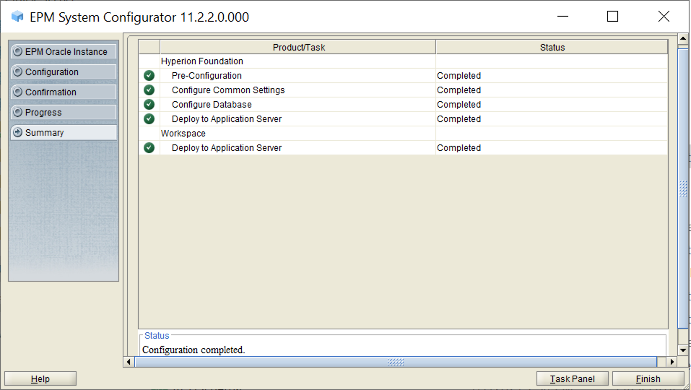

# EPM 11.2.2 Install Guide

## Install

> Install instructions have not changed since 11.1.2.4

1. Download EPM 11.2.2 Install files from edelivery.oracle.com
2. Make sure you comply with all prerequistes like Net.Framework 3.5 and UAC being turned off. Use the following like for a full list of prerequisites: [Oracle Link](https://docs.oracle.com/en/applications/enterprise-performance-management/11.2/hitis/preparing_servers.html)
3. Install 3rd Part Tools, Especially 7zip. Using the built in windows archive tool is not recommended.
4. Unzip all files to a single location (The path should have no spaces)
5. Run installTool as administrator
   
   

6. Duplicate on the rest of the servers in your deployment. The foundation server must have all the products intended for the environment installed locally in addition to the remote server where the product will live.

## Configuration

> IMPORTANT!! Do not start the configurator until all RCU steps have been completed

1. Create all necessary EPM databases including EPMS_RCU which is required for a successfull configuration. In 11.1.2.4 this was only required for certain products, but in 11.2.2 it is required for all products.

     * Use the following link to help with the creation of your databases: [Oracle Link](https://docs.oracle.com/en/applications/enterprise-performance-management/11.2/hitis/microsoft_sql_server_database_creation_requirements.html)
2. Run the following rcu bat file to create the require infrastructure schemas:
    * middleware home\oracle_commoon\bin\rcu.bat

    
3. Enter connection information for your SQL\Oracle DB server. The user used must be a system admin.

    > I am using localhost because this is a demo server but you will need to use a FQDN for your connection info, escpecially if you are running a distributed environment.
   
    

4. Select required components, and set the schema password.

    

5. Confirm all schemas were created successfully.

    

6. Edit the following file to include the informatin used when creating the infrastructure schemas:
    * D:\Oracle\Middleware\EPMSystem11R1\common\config\11.1.2.0\RCUSchema.properties

      > IMPORTANT!! This file will need to be created on every server in the environment before starting the configurator. This file cannot just be pasted due to password encryption.

      * Use the following link to help with editing the file to fit your environment: [Oracle Link](https://docs.oracle.com/en/applications/enterprise-performance-management/11.2/hitis/updating_rcu_properties_100x6cc886df.html)
  
      

      

7. Run the EPM configuration by running the following bat file as administrator:
      * D:\Oracle\Middleware\EPMSystem11R1\common\config\11.1.2.0\configtool.bat

      

8. Configure the instance, and enter the Foundation connection information

      

9. Configure Foundation only first

    > IMPORTANT!! Uncheck the deploy Java web application to a signle managed server option

    
    

10. If you performed the RCU steps correctly you will get the following check marks:
    
    

    > IMPORTANT!! If you don't get all greens checkboxes then you may have to investigate the config logs to see if you are getting login errors. This would mean the RCU steps were not performed correctly.
11. Once foundation is done you can move forward doing the same thing with all the other products remembering to change the database name for each product (See example below for CALC Manager). If you are on a distributed environment the RCU properties file will need to be edited on each server before starting the configurator. Save the configure web server for the last step.
    
    

12. Configure Web Server

    

13. Start Services

  > IMPORTANT!! At this point we would normally be done and could move on to tuning and patching, but there is a known bug with Analytic Provider Services in this version that will prevent APS from starting the next time you restart services. The issue is documented having the document id of 2693784.1. The fix for this issue is to apply a patch for APS from 11.1.2.4 (Patch 31206874: PATCHSET UPDATE: HYPERION ANALYTIC PROVIDER SERVICES 11.1.2.4.040)

