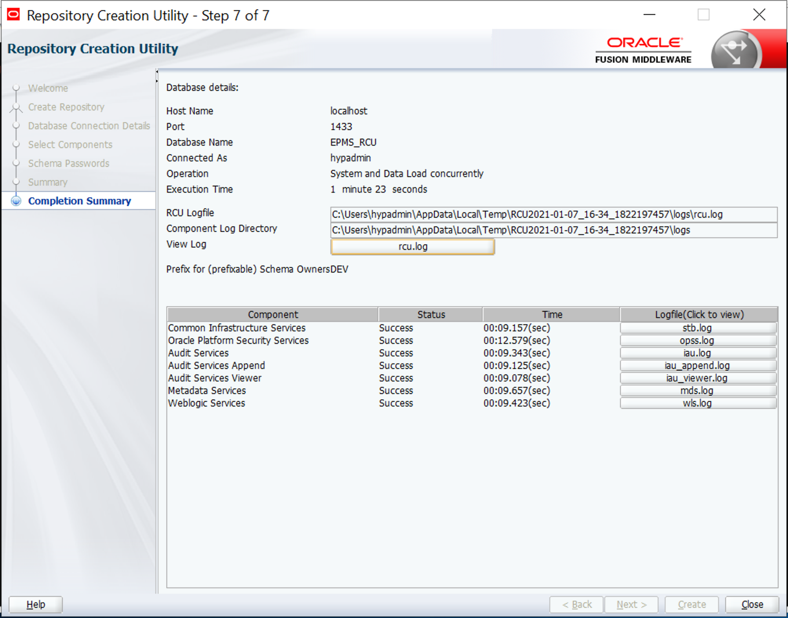

# EPM 11.2.2 Install Guide

## Install

> Install instructions have not changed since 11.1.2.4

1. Download EPM 11.2.2 Install files from edelivery.oracle.com
2. Unzip all files to a single location (The path should have no spaces)
3. Run installTool as administrator
   
   

4. Duplicate on the rest of the servers in your deployment. The foundation server must have all the products intended for the environment installed locally in addition to the remote server where the product will live.

## Configuration

1. Create all necessary EPM databases including EPMS_RCU which is required for a successfull configuration. In 11.1.2.4 this was only required for certain products, but in 11.2.2 it is required for all products.

     * Use the following link to help with the creation of your databases: [Oracle Link](https://docs.oracle.com/en/applications/enterprise-performance-management/11.2/hitis/microsoft_sql_server_database_creation_requirements.html)
2. Run the following rcu bat file to create the require infrastructure schemas:
    * middleware home\oracle_commoon\bin\rcu.bat

    
3. Enter connection information for your SQL\Oracle DB server. The user used must be a system admin.

> I am using localhost because this is a demo server but you will need to use a FQDN for your connection info, escpecially if you are running a distributed environment.
   
   
4. Select required components, and set the schema password.

    
5. Confirm all schemas were created successfully.

    
6. Edit the following file to include the informatin used when creating the infrastructure schemas:
    * D:\Oracle\Middleware\EPMSystem11R1\common\config\11.1.2.0\RCUSchema.properties

> This file will need to be created on every server in the environment before starting the configurator. This file cannot just be pasted due to password encryption.
    
    

    

7. Run the EPM configuration by running the following bat file as administrator:
      * D:\Oracle\Middleware\EPMSystem11R1\common\config\11.1.2.0\configtool.bat

      
